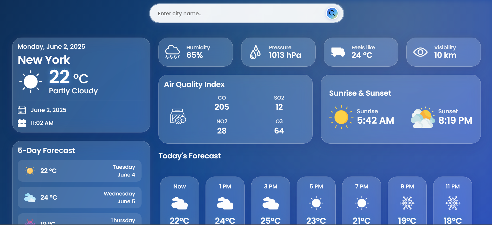

# 🌦️ Live Weather App

A modern, responsive web application delivering real-time weather data for any city using the [OpenWeatherMap API](https://openweathermap.org/api). Built with **HTML5**, **CSS3**, and **JavaScript**.

🔗 **Live Demo:** [View App](https://raju-neduri.github.io/Realtime-projects/Live%20Weather%20App/)

---

## 📸 Preview



---

## 🚀 Features

- City-based weather search with instant results
- Real-time temperature, humidity, weather conditions, and wind speed
- Dynamic weather icons reflecting current conditions
- Responsive design for seamless experience on all devices

---

## 🛠️ Tech Stack

- **HTML5** – Semantic markup
- **CSS3** – Responsive, modern UI/UX
- **JavaScript (ES6+)** – API integration, dynamic DOM updates
- **OpenWeatherMap API** – Weather data provider

---

## 📂 Project Structure

```
Live Weather App/
│
├── index.html        # Main HTML file
├── style.css         # Styling and layout
├── script.js         # Weather logic & API integration
├── Images/
│   └── image.png     # App screenshot
└── README.md         # Documentation
```

---

## 🌐 API Reference

- [OpenWeatherMap API](https://openweathermap.org/api)
  - Replace `YOUR_API_KEY` in `script.js` with your OpenWeatherMap API key.

---

## 🚀 Getting Started

1. **Clone the repository:**
   ```bash
   git clone https://github.com/your-username/Live-Weather-App.git
   ```
2. **Configure API Key:**
   - Open `script.js` and replace `YOUR_API_KEY` with your OpenWeatherMap API key.
3. **Launch the App:**
   - Open `index.html` in your browser.

---

## 🤝 Contributing

Contributions, issues, and feature requests are welcome! Please open an issue or submit a pull request.

---

## 📄 License

MIT License
